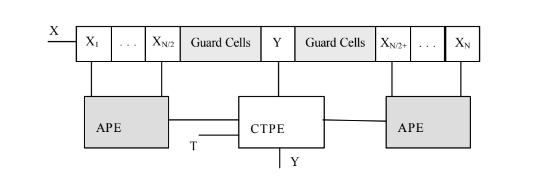
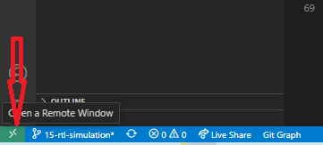

# MSE-PDS-TP

***Maestría en Sistemas Embebidos***

[https://www.fi.uba.ar](https://www.fi.uba.ar/posgrado/maestrias/sistemas-embebidos)

Proyecto final de la asignatura ***Procesamiento Digital de Señales***. 
 [Cagua, Jonathan](https://github.com/jonathancagua) 
 [Vaca, Gonzalo Nahuel](https://github.com/vacagonzalo)  
Este proyecto es de carácter académico y no se recomienda su uso en producción.

## Tabla de contenidos 💡

- [Resumen](#resumen)
- [Introducción](#introducción)
- [Programas](#programas)
- [Instrucciones](#instrucciones)
- [Licencia](#licencia)

## Resumen
Los algoritmos de procesamiento de la señal digital son necesario en muchas aplicaciones, pero estos demandan un alto nivel de carga computacional para muchos procesadores.

En el siguiente trabajo práctico presentamos una arquitectura de hardware para el procesamiento adaptativo de las señales ruidosas para la detección de objetivos basada en algoritmos de tasa de falsa alarma constante (CFAR).

Los detectores CFAR de ventana deslizante es uno de los mecanismos más comúnmente aplicado
para ejecutar la detección de blancos de radar.

La arquitectura propuesta se ha implementado en un dispositivo Field Programmable Gate Array (FPGA).

## Introducción
La tarea de los radares es ubicar a los blancos de radar dentro de una region observada estimando su posicion, velocidad.

El transmisor de radar emite ondas electromagnéticas esperando que se refleje algún objeto, produciendo eco que pueda recibir la antena de radar.

Varias etapas de procesamiento se encargan de extraer la información contenida en el eco.

El tiempo transcurrido entre la transmisión y la recepción de la señal emitida revela la distancia del objeto.

La detección de radar busca resolver el problema de la discriminación entre un falso objetivo y blancos.

Las técnicas más populares de detección son los detectores o procesadores CFAR (Constant False Alarm Rate, Razón de Falsas Alarmas Constante) de ventana deslizante.

### CA-CFAR (Cell Averaging-CFAR, CFAR de promedio de celdas)
CA-CFAR opera bajo el principio de ventana deslizante, bajo esta celda de evaluación se decide la presencia o no de un blanco.

El propósito de las celdas vecinas es la estimación del promedio en esa muestra, una vez promediado en APE se hace la comparación de los ***APE*** con el valor ***Y***, si la muestra ***Y*** esta por encima del umbral estimado.

El valor ***T*** es decisivo para la detección. Si  ***T*** es demasiado alta, el umbral resultante será muy elevado y la mayoría de los blancos estarán por debajo de él. Por lo contrario, si el valor de ***T*** es muy bajo, se detectarán la mayoría de los objetivos pero se clasifica erróneamente como blancos a muestras que sobrepasan ligeramente el promedio habitual.

## Programas
Los programas usados en el trabajo práctico son los siguiente:

- [Cocotb](https://docs.cocotb.org/en/stable/)
- [Docker](https://www.docker.com/)
    - Imagen [hdlc/sim:osvb](https://hub.docker.com/layers/hdlc/sim/osvb/images/sha256-2877c7fd1d5248ed47849513147c930548ba8444d968991ea5179dcb1f8da24f?context=explore)
- [Vscode](https://code.visualstudio.com/)
    - Extension [Dev Containers](https://code.visualstudio.com/docs/remote/containers) de Microsoft.
- [GTKWave](https://gtkwave.sourceforge.net/)

## Instrucciones
- Para ejecutar el proyecto se debe usar **visual code** y ejecutar la extension **Dev container**
    - En la parte inferior izquierda dar click en el icono  
    
    - Dar click en **Reopen in Container** (Revisar que esté corriendo el contenedor)
- En la carpeta del proyecto ejecutar el makefile. 
    `make help`

## Licencia

[MIT License](./LICENSE)